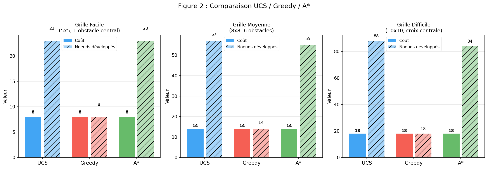
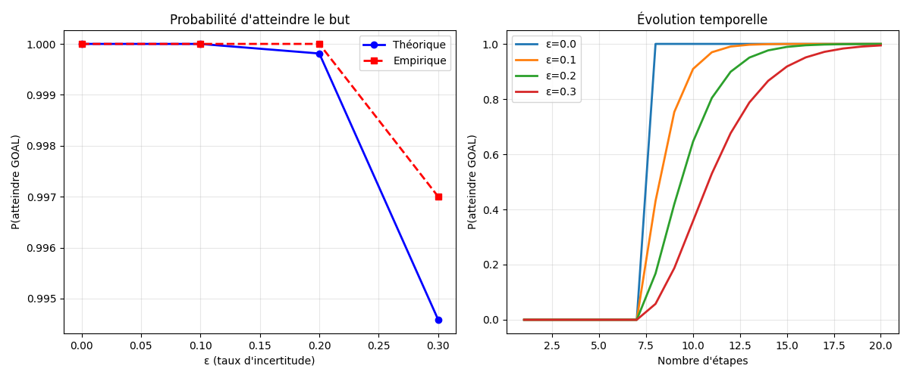
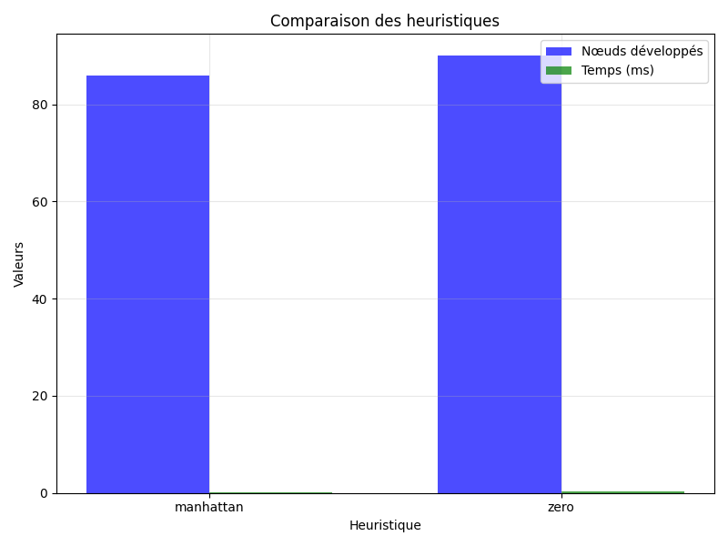
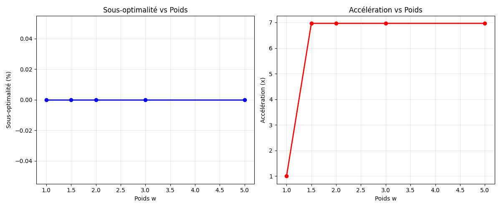

<div align="center">

# 🤖 Planification Robuste sur Grille
## A* + Chaînes de Markov

[](https://www.python.org/)
[](https://numpy.org/)
[](https://matplotlib.org/)
[](https://networkx.org/)

*Mini-projet — Bases de l'Intelligence Artificielle | 2025–2026*
*Réalisé par : BALMIR Salma*
*Supervisé par : M.MESTARI Mohamed*

[Vue d'ensemble](#-vue-densemble) •
[Installation](#-installation) •
[Utilisation](#-utilisation) •
[Architecture](#-architecture) •
[Résultats](#-résultats) •
[Théorie](#-fondements-théoriques)

</div>

---

## 🎯 Vue d'ensemble

Ce projet implémente une solution hybride pour la **planification robuste** d'un agent sur une grille 2D en environnement incertain. Il associe deux piliers de l'IA :

| Composant | Rôle |
|---|---|
| **Recherche heuristique** | A\* et variantes (UCS, Greedy, Weighted A\*) pour trouver un chemin optimal |
| **Chaînes de Markov** | Modéliser l'incertitude d'action, calculer π⁽ⁿ⁾ = π⁽⁰⁾ Pⁿ, analyser l'absorption |
| **Monte-Carlo** | Valider empiriquement les résultats théoriques par simulation |

**Question centrale :** comment planifier un chemin peu coûteux (A\*) tout en tenant compte d'une dynamique stochastique (Markov) et en évaluant la robustesse du plan ?

---

## 📊 Résultats des expériences

### E.1 — Comparaison UCS / Greedy / A\*



> Sur les 3 grilles, A\* trouve le chemin **optimal** avec une exploration **équilibrée**. Greedy explore moins de nœuds mais ne garantit pas l'optimalité en général.

### E.2 — Impact de l'incertitude ε sur P(GOAL)



> Plus ε augmente, plus le temps d'atteinte E\[T\] s'allonge. Pour ε ≤ 0.2, le plan A\* reste très robuste (P(GOAL) > 0.999).

### E.3 — Heuristiques : Manhattan vs h=0



### E.4 — Weighted A\* : compromis vitesse / optimalité



> w = 1.5 réduit les nœuds explorés de **84 à 18** (×4.67) sans perte d'optimalité (Manhattan admissible).

---

## ⚙️ Installation
```bash
# 1. Cloner le dépôt
git clone https://github.com/<votre-username>/planification-robuste-grille.git
cd planification-robuste-grille

# 2. (Recommandé) Créer un environnement virtuel
python -m venv .venv
source .venv/bin/activate        # Linux / macOS
.venv\Scripts\activate           # Windows

# 3. Installer les dépendances
pip install -r requirements.txt
```

**Dépendances :**
```
numpy>=1.21
matplotlib>=3.4
networkx>=2.6
```

---

## 🚀 Utilisation

### Interface interactive (recommandée)
```bash
python interface.py
```

L'interface regroupe **toutes les fonctionnalités** en un écran :

| Bouton | Action |
|---|---|
| `Planifier A*` | Affiche le chemin optimal + statistiques en temps réel |
| `Animer Agent` | Simule une trajectoire stochastique animée |
| `Monte Carlo` | Simule 2000 trajectoires + histogramme de distribution |
| `Comparer Algos` | E.1 : UCS / Greedy / A\* sur les 3 grilles |
| `Heuristiques` | E.3 : Manhattan vs h=0 |
| `Analyse Markov` | E.2 : π⁽ⁿ⁾, P(GOAL) vs ε, absorption, E\[T\] |
| `E4 — W-A*` | E.4 : Weighted A\* avec différents poids |
| `Slider ε` | Ajuste l'incertitude de 0.00 à 0.40 en direct |

### Ligne de commande
```bash
python main.py --experiment 0   # Démonstration complète
python main.py --experiment 1   # E.1 — UCS / Greedy / A*
python main.py --experiment 2   # E.2 — Impact de ε
python main.py --experiment 3   # E.3 — Heuristiques
python main.py --experiment 4   # E.4 — Weighted A*
```

### Utilisation des modules directement
```python
from astar import Grid, AStar
from markov import MarkovChain
from simulation import MarkovSimulation

# 1. Créer la grille et planifier
grid = Grid(5, 5, obstacles=[(2, 2)])
astar = AStar(grid, heuristic='manhattan')
result = astar.search((0, 0), (4, 4), algorithm='astar')
policy = astar.extract_policy(result['path'])

# 2. Construire la chaîne de Markov
absorbing = {(4, 4): 'GOAL', (-1, -1): 'FAIL'}
all_states = set(result['path']) | {(-1, -1)}
mc = MarkovChain(all_states, absorbing)
mc.build_from_policy(policy, grid, epsilon=0.1, fail_states=grid.obstacles)

# 3. Analyser
mc.print_analysis(initial_state=(0, 0))

# 4. Simuler
sim = MarkovSimulation(mc)
stats = sim.run_simulations((0, 0), n_simulations=1000, max_steps=50)
sim.analyze_simulations(stats, 1000)
```

---

## 🏗️ Architecture
```
planification-robuste-grille/
│
├── astar.py          # Phase 2 — Planification déterministe
│   ├── class Grid        → is_free, neighbors, heuristiques
│   └── class AStar       → search, extract_policy, compare_algorithms
│
├── markov.py         # Phases 3 & 4 — Modèle stochastique
│   └── class MarkovChain → build_from_policy, get_Pn, get_distribution,
│                           absorption_analysis, analyze_classes
│
├── simulation.py     # Phase 5 — Validation Monte-Carlo
│   └── class MarkovSimulation → simulate_trajectory, run_simulations,
│                                analyze_simulations, compare_with_theory
│
├── experiments.py    # Expériences E.1 à E.4
├── main.py           # Point d'entrée CLI (--experiment 0-4)
├── interface.py      # Interface graphique interactive (matplotlib)
├── requirements.txt
└── README.md
```

---

## 📐 Fondements théoriques

### Algorithme A\*

$$f(n) = g(n) + h(n)$$

- **g(n)** : coût accumulé depuis l'état initial s₀  
- **h(n)** : estimation admissible du coût restant vers le but  
- **Heuristique Manhattan** : `h((x,y)) = |x − x_g| + |y − y_g|`
  - Admissible : h(n) ≤ h*(n) ✅
  - Consistante : h(n) ≤ c(n,n') + h(n') ✅

| Algorithme | f(n) | Optimal | Mémoire |
|---|---|---|---|
| UCS | g(n) | ✅ Oui | O(bᵈ) |
| Greedy | h(n) | ❌ Non garanti | O(bᵐ) |
| A\* | g(n) + h(n) | ✅ Oui (si h admissible) | O(bᵈ) |
| Weighted A\* | g(n) + w·h(n) | ✅ w-optimal | O(bᵈ) |

### Chaîne de Markov

$$\pi^{(n)} = \pi^{(0)} \cdot P^n$$

**Modèle de transition avec bruit ε :**

$$P(s \to s') = \begin{cases} 1 - \varepsilon & \text{action recommandée} \\ \varepsilon/2 & \text{déviation latérale gauche} \\ \varepsilon/2 & \text{déviation latérale droite} \end{cases}$$

**Analyse d'absorption :**

$$N = (I - Q)^{-1} \qquad B = N \cdot R \qquad \mathbf{t} = N \cdot \mathbf{1}$$

- **N** : matrice fondamentale (espérance de visites par état transitoire)  
- **B** : probabilités d'absorption par état absorbant  
- **t** : temps moyen avant absorption

---

## 📈 Tableau des résultats

### E.1 — Grille Difficile 10×10

| Algorithme | Coût | Nœuds | OPEN max | Optimal |
|---|---|---|---|---|
| A\* | 18 | 84 | 9 | ✅ |
| UCS | 18 | 88 | 9 | ✅ |
| Greedy | 18 | 18 | 17 | ✅ (cas favorable) |

### E.2 — Grille Facile 5×5

| ε | P(GOAL) Pⁿ | E\[T\] absorption | T̄ simulation |
|---|---|---|---|
| 0.0 | 1.0000 | 8.00 étapes | 8.00 |
| 0.1 | 1.0000 | 8.95 étapes | 8.88 |
| 0.2 | 0.9996 | 10.16 étapes | 10.10 |
| 0.3 | 0.9905 | 11.73 étapes | 11.67 |

### E.4 — Weighted A\* sur Difficile 10×10

| Poids w | Coût | Nœuds | Accélération | Sous-optimalité |
|---|---|---|---|---|
| 1.0 | 18 | 84 | 1.00× | 0.0% |
| 1.5 | 18 | 18 | **4.67×** | 0.0% |
| 2.0 | 18 | 18 | 4.67× | 0.0% |
| 5.0 | 18 | 18 | 4.67× | 0.0% |

---

## 🔬 Grilles de test

| Grille | Dimensions | Obstacles | Départ | But |
|---|---|---|---|---|
| Facile | 5 × 5 | 1 obstacle en (2,2) | (0,0) | (4,4) |
| Moyenne | 8 × 8 | 2 clusters de 3 obstacles | (0,0) | (7,7) |
| Difficile | 10 × 10 | Croix centrale (16 obstacles) | (0,0) | (9,9) |

---


<div align="center">
<i>Projet réalisé dans le cadre du cours Bases de l'Intelligence Artificielle — 2025–2026</i>
</div>
